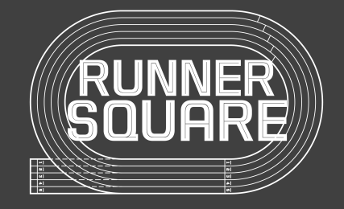

# ICT-Mini-Project-1
클라우드 기반 자바&amp;스프링개발자 과정 미니 프로젝트 1

### 참여자
* 팀장
  * 김학중
* 팀원
  * 강재현
  * 심영민
  * 양현의
  * 정인우

---

## 팀 프로젝트 주제

# 러닝 크루 사이트
### 달리기를 사랑하는 사람들을 위한 커뮤니티 공간

## Logo

## 타이틀

# <i><b> RUNNER SQUARE </b><i>

---

## 개발 기간
 * 프로젝트 주제 선정(2025.01.24)
 * 프로젝트 기획서 중간 점검(2025.02.11)
 * 프로젝트 기획서 제출(2025.02.14)
 * 프로젝트 시작(2025.02.18)
 * 프로젝트 발표(2025.02.27)

---

## 개발 범위 설정
### 개발 일정은 최대 3~4일까지 완료
### 진척의 어려움이 있을 시, 서포트 합류

 * ## 강재현
   * MyPage 사용자 관련 API
   * MyPage 크루장 관련 API

 * ## 양현의
   * 크루
     * CRUD

 * ## 김학중
   * 러닝
     * CRUD

 * ## 정인우
   * 회원관련 API
   * 신청내역 조회 / 신청 취소

 * ## 심영민
   * 알림
   * 배너
   * 팀 개발 서포트